# Shifa SDG Innovation Platform — Complete Technical Documentation

> Repository documentation generated from the implementation on 27 June 2026.
> This document describes the current Firebase application, its workflows, the landing-page editor, security model, packages, deployment process, and a proposed future PostgreSQL design.

## 1. Executive summary

The project is a React single-page application for running an innovation challenge. It combines five products in one frontend:

1. A public event website whose content can be edited and published by administrators.
2. Participant authentication, team registration, QR badge generation, profiles, and idea submission.
3. Administration for teams, users, judges, rounds, announcements, finalists, attendance, forms, and audit history.
4. Judge workspaces for reviewing assigned teams and recording scores.
5. Volunteer workspaces for scanning QR codes and recording attendance at controlled checkpoints.

Firebase currently supplies Authentication, Cloud Firestore, Cloud Storage, Cloud Functions, and Hosting. Firestore is the operational database. It is a document database, so collections correspond roughly to SQL tables and documents correspond roughly to SQL rows, but fields are not enforced as columns by the database itself.

## 2. System architecture

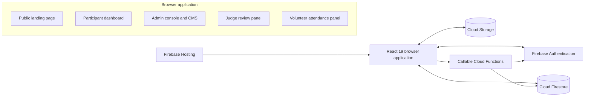

The app is client-heavy. Most reads and writes go directly from the browser to Firebase and are authorized by `firestore.rules` and `storage.rules`. Privileged callable operations include `deleteAuthUser` and the ownership-checked `ensureRegistrationTicket` legacy-ticket upgrade.

## 3. Technology stack and packages

### 3.1 Runtime dependencies

| Package | Version family | Current purpose |
|---|---:|---|
| `react`, `react-dom` | 19 | Component model, state, effects, rendering |
| `firebase` | 12.14 | Auth, Firestore, Storage, and callable Functions browser SDKs |
| `motion` | 12.23 | Page, modal, accordion, and UI animations via `motion/react` |
| `lucide-react` | 0.546 | Icon library throughout public, admin, judge, and volunteer interfaces |
| `qrcode` | 1.5 | Creates QR codes for registration badges |
| `jsqr` | 1.4 | Decodes QR codes from camera frames and uploaded images |
| `@google/genai` | 2.4 | Installed for future AI capability; no core production workflow currently depends on it |
| `express` | 4.21 | Installed at the root but not used by the current Vite/Firebase runtime |
| `dotenv` | 17.2 | Installed for environment loading in Node-oriented work; Vite uses `import.meta.env` in the browser |
| `@types/qrcode` | 1.5 | Type declarations; this is currently under runtime dependencies but can be moved to development dependencies |

### 3.2 Build and development dependencies

| Package | Purpose |
|---|---|
| `vite` | Development server and production bundler |
| `typescript` | Static checking with `npm run lint` (`tsc --noEmit`) |
| `@vitejs/plugin-react` | React transformation and Fast Refresh |
| `tailwindcss`, `@tailwindcss/vite` | Utility CSS and Vite integration |
| `autoprefixer` | CSS vendor prefix support |
| `tsx`, `esbuild` | TypeScript execution/build tooling; not directly referenced by a current npm script |
| `@types/node`, `@types/express` | Node and Express type definitions |

### 3.3 Cloud Functions dependencies

| Package | Purpose |
|---|---|
| `firebase-functions` | Defines the version 2 callable function |
| `firebase-admin` | Privileged Authentication and Firestore access |

Cloud Functions target Node.js 22.

## 4. Repository map

```text
src/
  App.tsx                         Manual client routing and shared application state
  data.ts                        Static tracks, schedule, prizes, mentors, and FAQs
  types.ts                       Shared participant, submission, volunteer, and attendance types
  components/
    AdminPanel.tsx               Main event administration console
    AdminLandingEditorPage.tsx   Standalone landing editor data controller
    landing-editor/
      LandingEditorPage.tsx      Three-pane visual CMS editor and media library
    DynamicLandingSections.tsx   Published dynamic section renderer
    AdminFormsManager.tsx        Dynamic form builder and response manager
    DynamicFormModal.tsx         Public dynamic form renderer/submission flow
    TeamDashboard.tsx            Participant idea workspace
    JudgeReviewPanel.tsx         Judge assignment and scoring workspace
    VolunteerPanel.tsx           QR scanning and attendance workflow
    AuthModal.tsx                Email/password and Google authentication
    ProfilePanel.tsx             Profile editing and registration pass access
  lib/
    firebase.ts                  Firebase client initialization
    landingContent.ts            CMS types, defaults, factories, and normalization
    landingAssets.ts             Built-in media catalog and asset type
    forms.ts                     Dynamic form types, factories, and normalization
    formSettings.ts              Registration/idea form configuration
    registrationBadge.ts         Registration IDs, QR URL, and badge generation helpers
functions/
  index.js                       Callable `deleteAuthUser` implementation
firestore.rules                  Firestore authorization policy
storage.rules                    Storage authorization and file validation
firebase.json                    Firestore, Storage, Functions, Hosting configuration
```

## 5. Navigation and application startup

The app does not use React Router. `App.tsx` maps `window.location.pathname` to an internal `Page` union and uses the browser history API.

| Path | Page/component | Intended audience |
|---|---|---|
| `/` | Public landing page | Everyone |
| `/register` | `RegistrationPage` | Signed-in participant |
| `/dashboard` | `TeamDashboard` | Registered participant |
| `/profile` and `/profil` | `ProfilePanel` page mode | Signed-in user |
| `/badge` | `BadgePreviewPage` | Newly registered participant |
| `/admin` | `AdminPanel` | Admin |
| `/landingediter` and `/landingeditor` | `AdminLandingEditorPage` | Admin |
| `/judge` | `JudgeReviewPanel` | Judge |
| `/volunteer` | `VolunteerPanel` | Volunteer or admin |
| `/reset-password` | `PasswordResetPage` | Password-reset recipient |

Startup sequence:

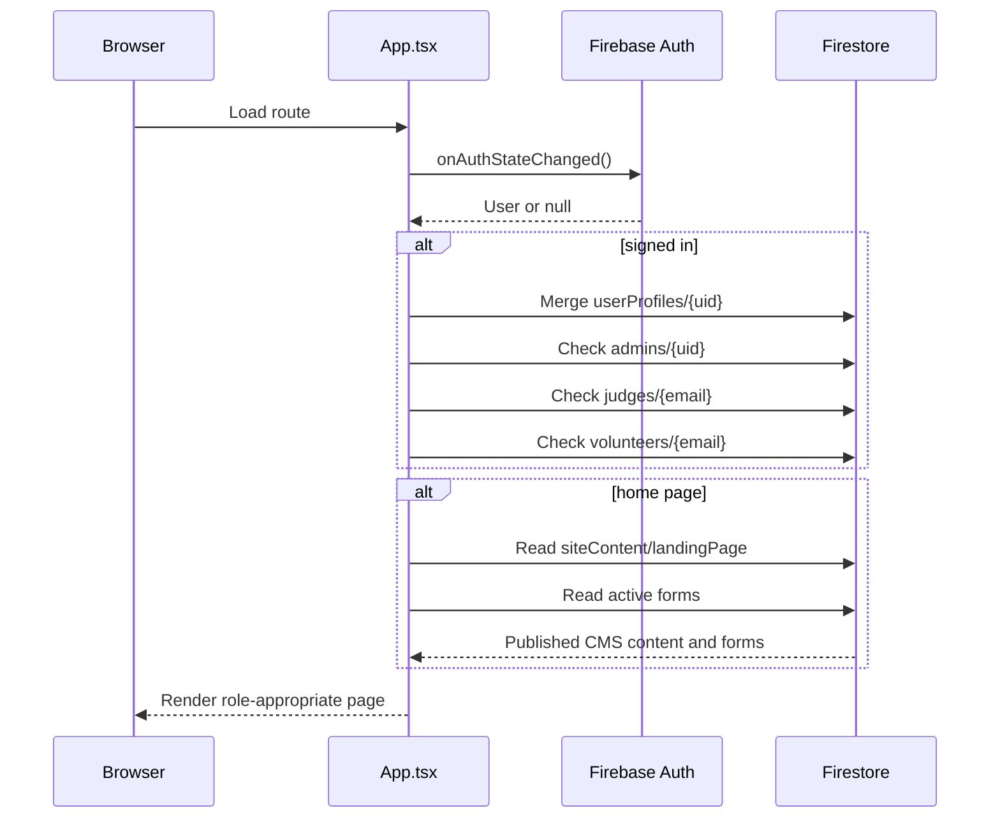

## 6. Roles and authorization

### 6.1 Roles

- **Public visitor:** reads published landing content, active form definitions, and public landing media.
- **Authenticated participant:** manages their profile, registers one team for the account, and owns one idea submission document keyed by UID.
- **Admin:** reads and writes operational data, manages CMS content, forms, assets, judges, volunteers, and users.
- **Judge:** reads their own judge record, assignments, and scores; can submit scores for assigned teams.
- **Volunteer:** reads active attendance data and marks only lists included in `allowedListIds`.

### 6.2 Role resolution

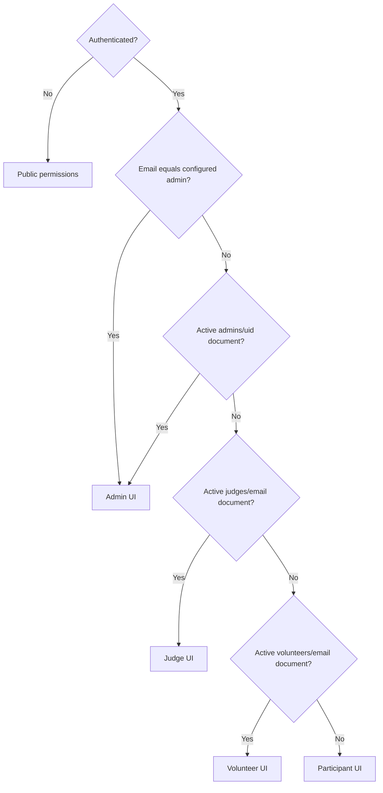

Frontend role checks only control presentation. Firestore and Storage rules are the real authorization boundary.

## 7. Current Firestore data model

There are **21 application collections** in the current rules and code. Because Firestore is schemaless, “column count” means fields expected by the TypeScript model and write paths. A document can contain additional fields unless rules explicitly restrict its keys.

### 7.1 Collection catalog

| Collection | Document ID | Main fields | Read/write model |
|---|---|---|---|
| `userProfiles` | Firebase UID | `uid`, `email`, `displayName`, `photoURL`, `avatarId`, `address`, `pinCode`, `gender`, provider IDs, timestamps | Owner and admin read; owner creates/updates; admin deletes |
| `registrations` | Encoded normalized team name | Team and leader data, members array, track, registration ID, owner UID, statuses, timestamps | Owner/admin/volunteer read; signed-in owner creates; admin updates/deletes |
| `teamNames` | Same team document ID | `teamName`, normalized key, `userId`, `createdAt` | Reservation preventing duplicate team names |
| `participantEmails` | Encoded normalized email | `email`, `teamName`, `registrationId`, `userId`, `createdAt` | Reservation preventing an email joining multiple teams |
| `accountRegistrations` | Firebase UID | `userId`, account email, team name, registration ID, embedded registration summary | Fast user-to-team lookup |
| `ideaSubmissions` | Firebase UID | Team identity, 15 narrative sections, 3 URLs, `status`, timestamps | Owner creates/updates; owner/admin reads; admin deletes |
| `admins` | Firebase UID | At minimum `active`; optional identity metadata | Admin-managed role registry |
| `judges` | Normalized email | Name, email, phone, organization, designation, expertise, domains, active state, assigned team IDs | Admin manages; judge can get own document |
| `judgeAssignments` | Composite ID | Judge, team, round, status, team snapshot, submission snapshot, timestamps | Admin assigns; judge reads own and marks assigned review completed |
| `scores` | Composite score ID | Team, judge, round, eight numeric criteria, comments, timestamps | Admin or assigned judge writes; owner judge/admin reads |
| `volunteers` | Normalized email | Name, email, active, `allowedListIds`, timestamps | Admin manages; volunteer gets own record |
| `attendanceLists` | Generated/list slug | Title, description, active, type, color, timestamps | Admin manages; volunteers read |
| `attendanceMarks` | `{listId}_{teamId}` | List/team snapshots, marker identity, QR payload/source, timestamps | Admin/volunteer reads; controlled transactional create |
| `announcements` | Generated ID | Title, description, priority, target, team IDs, publish date, timestamp | Signed-in read; admin writes |
| `notifications` | Announcement or announcement/user composite ID | Target, optional user/team identity, announcement content | Recipient/admin read; admin writes |
| `finalists` | Team ID | Team ID, approval, presentation time, timestamp | Signed-in read; admin writes |
| `auditLogs` | Time/random ID | Action, admin name, timestamp | Admin only |
| `siteContent` | `landingPage`, `landingPageDraft`, `formSettings` | CMS document or form-settings document | Public read; admin write |
| `landingAssets` | Generated asset ID | Title, URL, type, thumbnail, alt, size, content type, storage path, source, timestamp | Public metadata read; admin write |
| `forms` | Slug | Title, description, status, ordered embedded field array, messages, redirect, timestamps | Public read; admin write |
| `formSubmissions` | Auto ID | Form identity, answer map, source context, timestamp | Active form may create; admin reads/updates/deletes |

### 7.2 Why duplicate reservation collections exist

Firestore has no unique constraint. Registration therefore uses a transaction that reads and writes three reservation views before creating the main registration:

- `teamNames/{normalizedTeamName}` gives team-name uniqueness.
- `participantEmails/{normalizedEmail}` gives participant-email uniqueness.
- `accountRegistrations/{uid}` guarantees one registration lookup per login.

The main `registrations` document remains the canonical team record. These duplicates must be updated or deleted together; SQL unique indexes would replace this pattern.

### 7.3 Current document relationship diagram

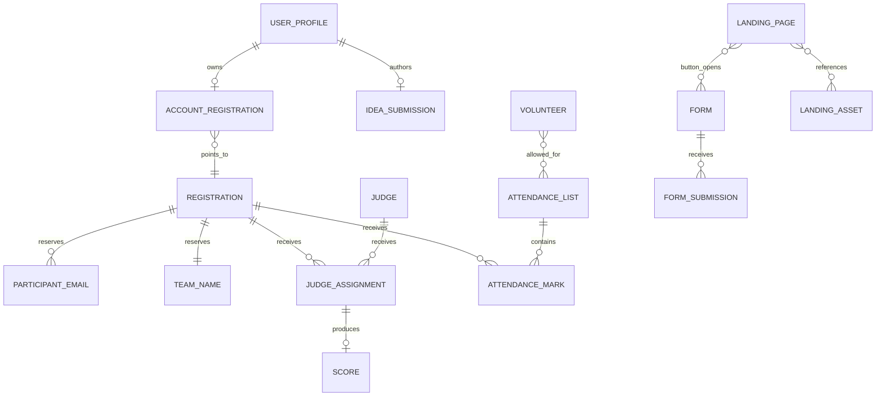

This diagram is conceptual. Several relationships are embedded strings, arrays, or snapshots rather than Firestore references.

### 7.4 How to obtain the real current row/document counts

Source code can identify collections but cannot reveal live document counts. Run counts from a trusted Node/Admin SDK environment, never from an untrusted public client:

```js
const { initializeApp } = require('firebase-admin/app');
const { getFirestore } = require('firebase-admin/firestore');

initializeApp();
const db = getFirestore();
const collections = [
  'userProfiles', 'registrations', 'teamNames', 'participantEmails',
  'accountRegistrations', 'ideaSubmissions', 'admins', 'judges',
  'judgeAssignments', 'scores', 'volunteers', 'attendanceLists',
  'attendanceMarks', 'announcements', 'notifications', 'finalists',
  'auditLogs', 'siteContent', 'landingAssets', 'forms', 'formSubmissions',
];

for (const name of collections) {
  const result = await db.collection(name).count().get();
  console.log(name, result.data().count);
}
```

This reports Firestore documents (“rows”), not nested array entries such as team members, form fields, or landing sections. Count those separately during SQL migration. Firebase Authentication user count must also be obtained from the Admin Auth API because Auth users are not Firestore documents.

## 8. Team registration workflow

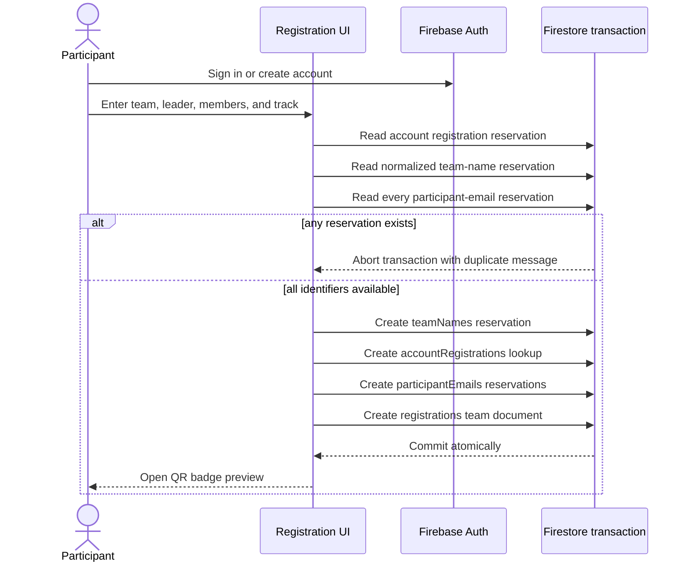

The registration ID is client-generated in the form `SDG-{timestamp}-{random}`. The document ID is based on the normalized team name, not the registration ID.

Each new registration also receives a random UUID `ticketId` and `ticketVersion: 1`. Its QR contains only `type`, `version`, `eventId`, `ticketId`, `registrationId`, and `teamId`; it does not expose leader phone, college, location, or other personal data. Existing registrations without a `ticketId` continue to generate an identifier-only legacy QR and remain usable.

When the owner of an older registration opens the Profile pass, the authenticated `ensureRegistrationTicket` callable verifies ownership and atomically adds a server-generated version 1 ticket to the registration and account summary. This upgrades old teams without granting participants general registration-update permission.

## 9. Participant idea workflow

1. The dashboard looks up `accountRegistrations/{uid}`.
2. It loads the canonical `registrations/{teamId}` document.
3. It loads `siteContent/formSettings` and normalizes missing values against defaults.
4. It loads `ideaSubmissions/{uid}`, if one exists.
5. The participant edits configurable domains, narrative sections, and link fields.
6. Save Draft or Submit writes the same document using `status: draft` or `status: submitted`.
7. Firestore rules require the document `userId` to match `request.auth.uid`, a valid status, and a string `teamName`.

The idea form currently includes 15 long-text sections and three link fields. Admin settings can enable fields, change labels/placeholders, set length limits, and mark fields required without deploying new frontend code.

## 10. Judge workflow

1. Judge identity is keyed by normalized email in `judges`.
2. Admin selects teams, judge, and round and creates `judgeAssignments` documents.
3. Assignments contain team and submission snapshots so the review remains understandable even if source records later change.
4. Judge reads only assignments whose `judgeId` equals the authenticated email.
5. Judge scores eight criteria: innovation, problem relevance, feasibility, technical strength, SDG impact, scalability, market potential, and presentation.
6. A score write is permitted only when the referenced assignment exists and its judge/team match the score.
7. The judge may update only assignment `status`, `reviewedAt`, and `updatedAt`, and only to mark it completed.

### 10.1 Round progression rules

The three-round workflow is sequential: `Round 1 → Round 2 → Round 3`.

1. A submitted, non-rejected team without `currentRound` is treated as Round 1.
2. Judge assignment only lists teams active in the selected round.
3. An existing assignment to the same judge/team/round is locked and cannot be recreated.
4. Every current-round judge assignment must be completed before the team can be approved.
5. The team must be approved before it can advance, and it can advance only to the immediately following round.
6. Advancement resets the team to `under-review` for the new round.
7. Rejection is terminal for the event: pending assignments are deleted, the team is removed from selection, scoring and finalist selection are blocked, and the team cannot advance.
8. Completed assignments and scores remain as historical review records after rejection.

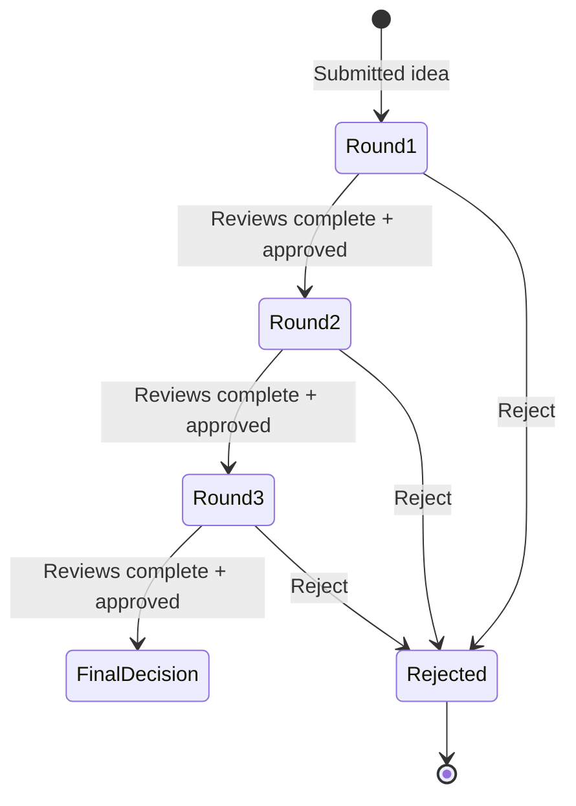

## 11. Volunteer and attendance workflow

Volunteers are keyed by email and receive a list of checkpoint IDs. The browser subscribes in real time to attendance lists, marks, and registrations. QR input can come from a live camera, an uploaded image, a URL, JSON, a registration ID, or manual text.

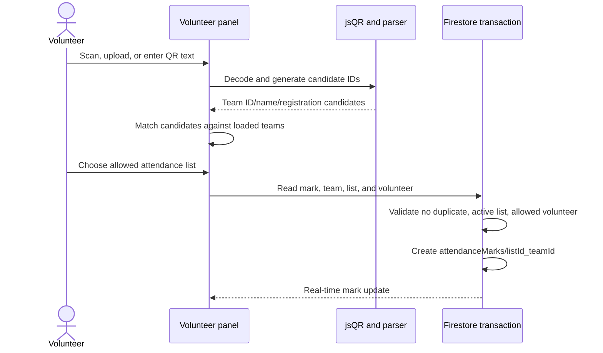

The deterministic mark ID creates idempotency: the same team cannot be marked twice for the same list.

The scanner classifies input as `verified-ticket`, `legacy-qr`, or `manual-lookup`. A versioned ticket is accepted only when its event, UUID, registration ID, and team ID all match the protected registration document. A disabled team is rejected. Attendance rows preserve the verification class for later audit and reporting. Legacy and manual modes are retained as operational fallbacks for registrations created before ticket version 1.

## 12. Dynamic forms and file uploads

### 12.1 Form builder

Admins can create a form with a slug, title, description, active/inactive status, ordered fields, submit text, success message, and redirect URL. Supported fields are text, email, phone, number, select, radio, checkbox, date, file, and textarea.

Forms are embedded in landing buttons. The editor only offers active forms. The public app also filters forms to active status before resolving a button action.

### 12.2 Submission flow

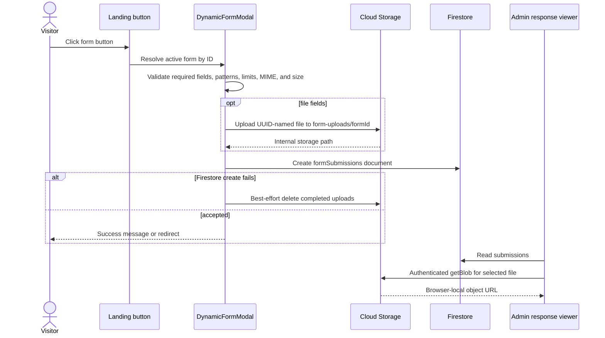

New uploads store `storage://form-uploads/...` references rather than public download URLs. Existing historical submissions can still contain Firebase download URLs and need separate migration/token revocation if they are sensitive.

## 13. Landing-page editor — complete workflow

### 13.1 Data documents

The editor uses two Firestore documents:

| Document | Meaning |
|---|---|
| `siteContent/landingPage` | Published content read by the public home page |
| `siteContent/landingPageDraft` | Unpublished admin working copy |

`siteContent/formSettings` is separate and configures registration and idea forms, not the landing-page composition.

### 13.2 Content shape

One landing document contains:

- `globalTheme`: body/heading fonts, primary/accent colors, backgrounds, text color, and radius preset.
- `header`: logo text, repeatable navigation links, visibility toggles, and button action.
- `hero`: badge, heading, subheading, description, two button actions, media, colors, alignment, and visibility.
- `sections[]`: ordered polymorphic sections with type, copy, media, visibility, repeatable items, CTA data, typography, spacing, gradient, alignment, and maximum width.
- `footer`: logo, description, repeatable links/social links, copyright, and colors.
- audit metadata: `updatedAt`, `updatedBy`, `updatedByEmail`, and `updatedSection`.

Supported section types are `about`, `domains`, `stages`, `prizes`, `mentors`, `faq`, `glimpses`, `gallery`, `highlights`, `testimonials`, `sponsors`, `cta`, `form-cta`, and `custom`.

### 13.3 Load, edit, draft, and publish

```mermaid
sequenceDiagram
    actor Admin
    participant Controller as AdminLandingEditorPage
    participant Editor as LandingEditorPage
    participant DB as Firestore
    participant Public as Public App

    Admin->>Controller: Open /landingediter
    Controller->>DB: Read landingPage and landingPageDraft
    DB-->>Controller: Published and optional draft documents
    Controller->>Controller: Normalize content; draft falls back to published
    Controller->>Editor: Pass draft as controlled content
    Admin->>Editor: Edit theme/header/hero/section/footer
    Editor->>Editor: Push previous state to undo stack
    Editor->>Controller: onChange(next content)
    alt Save Draft
      Controller->>DB: Merge landingPageDraft
    else Publish
      Controller->>DB: Merge landingPage
      Controller->>DB: Merge same payload into landingPageDraft
      Public->>DB: Read landingPage on next home load
    end
```

Publishing intentionally synchronizes both documents so the editor starts from exactly what the public sees. Saving a draft never changes the published document.

### 13.4 Editor interface

The editor is a responsive three-pane workspace:

- **Left — structure:** global theme, header, hero, ordered sections, footer, add section, duplicate, show/hide, and move up/down.
- **Center — live preview:** desktop, tablet, and mobile frames using the same `Navbar`, `Hero`, `DynamicLandingSections`, and `Footer` rendering components as production.
- **Right — inspector:** controls appropriate to the selected block: copy, colors, typography, layout, media, CTA behavior, repeatable links, or repeatable items.

On small screens, these become Sections, Preview, and Settings tabs. The desktop left pane is resizable between 76 and 420 pixels.

### 13.5 Change history

Undo and redo live only in React memory. The editor stores up to 40 snapshots in each direction. `Ctrl/Cmd+Z` triggers undo and `Ctrl/Cmd+Shift+Z` triggers redo. Reloading or leaving the page clears this history; only an explicit Save Draft persists unfinished work.

### 13.6 Normalization and fallback behavior

`normalizeLandingContent` merges stored data with `defaultLandingContent`. This protects rendering when older documents lack newly added fields. Legacy button text/URL values are converted to the newer button configuration where necessary. Sections and items receive normalized media, visibility, appearance, and order values.

If the public `landingPage` document cannot be loaded, the public site renders `defaultLandingContent` compiled into the bundle.

### 13.7 Media library

Media comes from two sources:

1. Static assets defined in `landingAssets.ts` and shipped with the application.
2. Admin uploads stored under `landing-assets/{category}/{timestamp}-{safeName}`, with metadata in `landingAssets/{assetId}`.

The editor caches uploaded asset metadata in module-level memory, supports image/video filtering and search, tracks resumable-upload progress, and can delete both the Firestore metadata and Storage object. Media settings include crop fit, focal point, zoom, rotation, alt text, poster, and thumbnail.

Important implementation mismatch: the media file input currently advertises SVG support, while the hardened Storage rules reject SVG. The UI accept list should be aligned before enabling SVG or should continue rejecting SVG because active SVG content has script/security implications.

### 13.8 Landing button actions

Every configured button has:

- visibility;
- text;
- style: primary, secondary, dark, or outline;
- action: open form, external URL, scroll to section, or none;
- an action-specific target.

At runtime, `App.tsx` resolves form IDs against the loaded active forms. Missing or inactive forms display an error rather than opening stale configuration.

## 14. Security model

### 14.1 Firestore rules

- Ownership is generally based on Firebase UID.
- Judge and volunteer identities are based on normalized authenticated email.
- Admin is either the hardcoded primary email or an active `admins/{uid}` document.
- Public content is limited to `siteContent`, `landingAssets`, and `forms` reads.
- Form submissions allow public create only after validating top-level keys and confirming the form exists and is active.
- Unmatched collections are denied by default.

### 14.2 Storage rules

- `landing-assets/**` is publicly readable because it powers the public site.
- Only admins may create/update/delete landing assets.
- Landing assets are limited to selected raster image and video MIME types and under 30 MiB.
- `form-uploads/{formId}/{fileName}` is admin-readable only.
- Public creation requires a UUID filename, non-empty file of at most 10 MiB, supported MIME type, and an active form.
- Only admins can replace or delete a form attachment.
- All other paths are denied.

### 14.3 Cloud Function security

`deleteAuthUser`:

1. Requires authentication.
2. Refuses self-deletion from the panel.
3. verifies the primary admin email or active admin document.
4. Deletes the Firebase Auth user.
5. Deletes profile, registration lookup, idea submission, reservations, owned teams, and finalists.
6. Removes the deleted email from teams they joined as a member.
7. Attempts to append an audit log.

### 14.4 Known security and reliability follow-ups

1. Add `email_verified == true` consistently to the Firestore and Function primary-email admin checks, as Storage already does.
2. Enable Firebase App Check for Firestore, Storage, and callable Functions.
3. Put public form submission behind a server endpoint with rate limiting, CAPTCHA, content scanning, and quotas. Rules cannot provide per-IP throttling.
4. Tighten Firestore create/update rules with `keys().hasOnly`, types, lengths, and immutable-field checks for every sensitive collection.
5. Move the primary admin identity entirely to custom claims or a protected role table instead of hardcoding an email in rules.
6. Migrate and revoke historical public attachment download tokens.
7. Configure Storage CORS for the exact production/admin origins so authenticated `getBlob` viewing works.
8. Add malware scanning and quarantine before admins open user uploads.
9. Restrict the Firebase web API key by API and authorized web origins. A web Firebase key is not a secret, but restriction limits abuse.
10. Add emulator-based authorization tests before every rules deployment.

## 15. Build, environment, and deployment

### 15.1 Required frontend environment variables

```env
VITE_FIREBASE_API_KEY=
VITE_FIREBASE_AUTH_DOMAIN=
VITE_FIREBASE_PROJECT_ID=
VITE_FIREBASE_STORAGE_BUCKET=
VITE_FIREBASE_MESSAGING_SENDER_ID=
VITE_FIREBASE_APP_ID=
VITE_FIREBASE_FUNCTIONS_REGION=us-central1
VITE_ADMIN_EMAIL=
```

Never put `ADMIN_PASSWORD`, service-account JSON, private API keys, or Admin SDK credentials in a `VITE_` variable. Vite embeds every `VITE_` value in the public browser bundle.

### 15.2 Local commands

```bash
npm install
npm run dev
npm run lint
npm run build
npm run preview
```

### 15.3 Firebase deployment

```bash
npm run lint
npm run build
firebase deploy --only firestore:rules,storage
firebase deploy --only functions
firebase deploy --only hosting
```

Or deploy all configured targets with `firebase deploy` after testing.

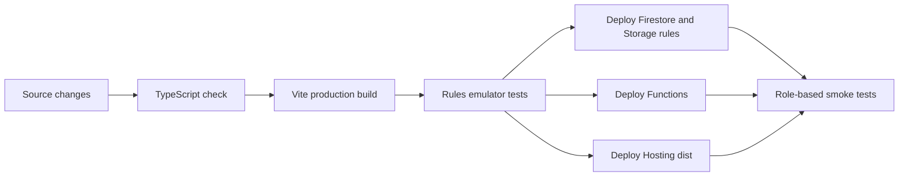

## 16. Observability, backups, and testing recommendations

- Add Firebase Emulator Suite tests for public, participant, admin, judge, and volunteer access matrices.
- Add unit tests for normalizers, QR parsing, form validation, and registration identifiers.
- Add integration tests for transactional registration and attendance idempotency.
- Add end-to-end tests for draft/publish isolation and dynamic form uploads.
- Enable Cloud Logging alerts for Function errors and permission-denied spikes.
- Export Firestore daily to a versioned Cloud Storage backup bucket with retention policy.
- Track failed uploads, orphan cleanup, submission volume, and storage growth.
- Use error reporting such as Sentry or Cloud Error Reporting for client failures.
- Add bundle splitting; the current production JavaScript bundle is approximately 1.5 MB before gzip.

## 17. Future SQL upgrade recommendation

### 17.1 Recommended platform

Use **PostgreSQL 16 or newer**. Keep Firebase Authentication initially and store its UID in `users.firebase_uid`. Keep binary media in object storage; store only metadata and storage keys in SQL. Put all writes behind an API rather than connecting the browser directly to PostgreSQL.

Suggested backend choices:

- TypeScript with Fastify or NestJS;
- Prisma or Drizzle for migrations and typed queries;
- PostgreSQL Row-Level Security if using Supabase, otherwise enforce authorization in the API;
- Redis only when rate limiting, queues, or caching justify it;
- a background worker for email, file scanning, exports, and cleanup.

### 17.2 Proposed size

The normalized proposal below contains **27 tables and 292 named columns**. That is a schema count, not a current production row count.

Current row counts cannot be determined from this repository. They must be measured with an authenticated Firestore inventory/export. SQL rows will grow according to user activity:

| Table group | Row growth rule | Example at 10,000 users / 2,500 teams |
|---|---|---:|
| Users and roles | About one user plus one or more roles per account | 10k–15k |
| Teams and members | One team plus 3–8 members | 2.5k teams, roughly 10k members |
| Ideas | Zero or one current submission per team, more if versioning is added | Up to 2.5k current rows |
| Assignments and scores | Teams × assigned judges × rounds | Often 7.5k–30k each |
| Attendance marks | Teams × attended checkpoints | Up to 250k at 100 checkpoints |
| Dynamic answers | Submissions × answered fields | The fastest-growing relational table |
| Notifications | Announcements × recipients when materialized | Potentially millions; partition or compute broad broadcasts |
| Audit logs | One or more rows per privileged action | Unbounded; time-partition yearly/monthly |

These are planning examples, not limits. PostgreSQL can handle millions of rows comfortably with correct indexes, bounded queries, connection pooling, and maintenance.

After migration, approximate SQL row counts are available cheaply from `pg_stat_user_tables`:

```sql
SELECT relname AS table_name, n_live_tup AS estimated_rows
FROM pg_stat_user_tables
ORDER BY relname;
```

Use `SELECT count(*)` for an exact count of an individual table when necessary; exact full-table counts can be expensive on very large tables.

### 17.3 Proposed table catalog and column count

| # | Table | Columns | Purpose |
|---:|---|---:|---|
| 1 | `users` | 11 | Account/profile identity linked to Firebase Auth |
| 2 | `user_roles` | 5 | Multi-role authorization |
| 3 | `events` | 12 | Supports multiple future events instead of hardcoded 2026 data |
| 4 | `teams` | 21 | Canonical team registration |
| 5 | `team_members` | 10 | Normalized leader/member rows and unique email enforcement |
| 6 | `idea_submissions` | 26 | Current idea submission content and status |
| 7 | `judges` | 11 | Judge profile and availability |
| 8 | `judge_domains` | 3 | Judge expertise/domain many-to-many rows |
| 9 | `judge_assignments` | 11 | Judge/team/round assignments |
| 10 | `scores` | 16 | Eight scoring criteria and comments |
| 11 | `announcements` | 11 | Announcement definition |
| 12 | `announcement_recipients` | 5 | Per-user delivery/read state |
| 13 | `finalists` | 8 | Finalist state and presentation slot |
| 14 | `volunteers` | 7 | Volunteer profile/state |
| 15 | `attendance_lists` | 10 | Event checkpoints |
| 16 | `volunteer_list_access` | 4 | Volunteer/list authorization join |
| 17 | `attendance_marks` | 13 | One team/checkpoint attendance record |
| 18 | `cms_versions` | 10 | Draft, published, and historical landing JSON |
| 19 | `media_assets` | 14 | Object-storage metadata |
| 20 | `dynamic_forms` | 12 | Form definition |
| 21 | `dynamic_form_fields` | 15 | Ordered typed form fields |
| 22 | `dynamic_form_options` | 6 | Select/radio/checkbox choices |
| 23 | `dynamic_form_submissions` | 10 | Submission envelope and source attribution |
| 24 | `dynamic_form_answers` | 9 | Typed answer rows |
| 25 | `uploaded_files` | 15 | Private attachment metadata and scan state |
| 26 | `event_settings` | 7 | Versionable registration/dashboard configuration |
| 27 | `audit_logs` | 10 | Append-only privileged activity |

### 17.4 Proposed SQL relationship diagram

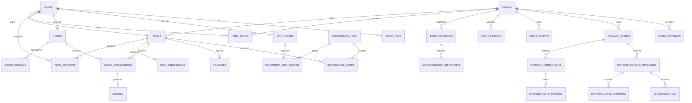

### 17.5 PostgreSQL schema format

The following DDL is a practical starting point. UUID primary keys avoid exposing sequential IDs. `timestamptz` keeps timestamps timezone-safe. `jsonb` is retained only where flexible snapshots or CMS documents are valuable.

```sql
CREATE EXTENSION IF NOT EXISTS pgcrypto;

CREATE TYPE app_role AS ENUM ('participant','admin','judge','volunteer');
CREATE TYPE record_status AS ENUM ('draft','submitted','active','inactive','archived');
CREATE TYPE assignment_status AS ENUM ('pending','completed');
CREATE TYPE scan_source AS ENUM ('camera','upload','manual');
CREATE TYPE asset_type AS ENUM ('image','video','document');
CREATE TYPE scan_status AS ENUM ('pending','clean','infected','failed');

CREATE TABLE users (
  id uuid PRIMARY KEY DEFAULT gen_random_uuid(),
  firebase_uid text NOT NULL UNIQUE,
  email text NOT NULL,
  normalized_email text NOT NULL UNIQUE,
  display_name text NOT NULL DEFAULT '',
  photo_url text,
  avatar_id text,
  address text,
  pin_code text,
  gender text CHECK (gender IN ('male','female') OR gender IS NULL),
  created_at timestamptz NOT NULL DEFAULT now()
);

CREATE TABLE events (
  id uuid PRIMARY KEY DEFAULT gen_random_uuid(),
  slug text NOT NULL UNIQUE,
  name text NOT NULL,
  description text NOT NULL DEFAULT '',
  starts_at timestamptz,
  ends_at timestamptz,
  timezone text NOT NULL DEFAULT 'Asia/Kolkata',
  registration_open boolean NOT NULL DEFAULT false,
  submission_open boolean NOT NULL DEFAULT false,
  active boolean NOT NULL DEFAULT true,
  created_at timestamptz NOT NULL DEFAULT now(),
  updated_at timestamptz NOT NULL DEFAULT now()
);

CREATE TABLE user_roles (
  id uuid PRIMARY KEY DEFAULT gen_random_uuid(),
  user_id uuid NOT NULL REFERENCES users(id) ON DELETE CASCADE,
  event_id uuid REFERENCES events(id) ON DELETE CASCADE,
  role app_role NOT NULL,
  created_at timestamptz NOT NULL DEFAULT now(),
  UNIQUE (user_id, event_id, role)
);

CREATE TABLE teams (
  id uuid PRIMARY KEY DEFAULT gen_random_uuid(),
  event_id uuid NOT NULL REFERENCES events(id) ON DELETE CASCADE,
  owner_user_id uuid NOT NULL REFERENCES users(id),
  registration_code text NOT NULL UNIQUE,
  name text NOT NULL,
  normalized_name text NOT NULL,
  leader_name text NOT NULL,
  leader_email text NOT NULL,
  phone_number text NOT NULL,
  location text NOT NULL,
  college_name text NOT NULL,
  field_of_study text NOT NULL,
  team_size smallint NOT NULL CHECK (team_size BETWEEN 1 AND 8),
  track text NOT NULL,
  experience_level text NOT NULL DEFAULT '',
  github_url text,
  code_of_conduct_accepted boolean NOT NULL DEFAULT false,
  access_status text NOT NULL DEFAULT 'enabled' CHECK (access_status IN ('enabled','disabled')),
  review_status text NOT NULL DEFAULT 'pending',
  current_round text,
  created_at timestamptz NOT NULL DEFAULT now(),
  UNIQUE (event_id, normalized_name),
  UNIQUE (event_id, owner_user_id)
);

CREATE TABLE team_members (
  id uuid PRIMARY KEY DEFAULT gen_random_uuid(),
  event_id uuid NOT NULL REFERENCES events(id) ON DELETE CASCADE,
  team_id uuid NOT NULL REFERENCES teams(id) ON DELETE CASCADE,
  user_id uuid REFERENCES users(id) ON DELETE SET NULL,
  name text NOT NULL,
  email text NOT NULL,
  normalized_email text NOT NULL,
  is_leader boolean NOT NULL DEFAULT false,
  joined_at timestamptz NOT NULL DEFAULT now(),
  updated_at timestamptz NOT NULL DEFAULT now(),
  UNIQUE (team_id, normalized_email),
  UNIQUE (event_id, normalized_email)
);

CREATE TABLE idea_submissions (
  id uuid PRIMARY KEY DEFAULT gen_random_uuid(),
  team_id uuid NOT NULL UNIQUE REFERENCES teams(id) ON DELETE CASCADE,
  author_user_id uuid NOT NULL REFERENCES users(id),
  title text NOT NULL DEFAULT '',
  problem_statement text NOT NULL DEFAULT '',
  existing_gaps text NOT NULL DEFAULT '',
  proposed_solution text NOT NULL DEFAULT '',
  innovation text NOT NULL DEFAULT '',
  use_cases text NOT NULL DEFAULT '',
  architecture_workflow text NOT NULL DEFAULT '',
  technology_stack text NOT NULL DEFAULT '',
  validation text NOT NULL DEFAULT '',
  market_potential text NOT NULL DEFAULT '',
  business_model text NOT NULL DEFAULT '',
  demo text NOT NULL DEFAULT '',
  demo_url text,
  pitch_url text,
  ppt_url text,
  future_scope text NOT NULL DEFAULT '',
  impact text NOT NULL DEFAULT '',
  conclusion text NOT NULL DEFAULT '',
  status record_status NOT NULL DEFAULT 'draft',
  submitted_at timestamptz,
  created_at timestamptz NOT NULL DEFAULT now(),
  updated_at timestamptz NOT NULL DEFAULT now(),
  version integer NOT NULL DEFAULT 1
);

CREATE TABLE judges (
  id uuid PRIMARY KEY DEFAULT gen_random_uuid(),
  event_id uuid NOT NULL REFERENCES events(id) ON DELETE CASCADE,
  user_id uuid REFERENCES users(id) ON DELETE SET NULL,
  name text NOT NULL,
  email text NOT NULL,
  normalized_email text NOT NULL,
  phone text NOT NULL DEFAULT '',
  organization text NOT NULL DEFAULT '',
  designation text NOT NULL DEFAULT '',
  expertise text NOT NULL DEFAULT '',
  active boolean NOT NULL DEFAULT true,
  UNIQUE (event_id, normalized_email)
);

CREATE TABLE judge_domains (
  judge_id uuid NOT NULL REFERENCES judges(id) ON DELETE CASCADE,
  domain_id text NOT NULL,
  created_at timestamptz NOT NULL DEFAULT now(),
  PRIMARY KEY (judge_id, domain_id)
);

CREATE TABLE judge_assignments (
  id uuid PRIMARY KEY DEFAULT gen_random_uuid(),
  event_id uuid NOT NULL REFERENCES events(id) ON DELETE CASCADE,
  judge_id uuid NOT NULL REFERENCES judges(id) ON DELETE CASCADE,
  team_id uuid NOT NULL REFERENCES teams(id) ON DELETE CASCADE,
  round_name text NOT NULL,
  status assignment_status NOT NULL DEFAULT 'pending',
  team_snapshot jsonb NOT NULL DEFAULT '{}',
  submission_snapshot jsonb NOT NULL DEFAULT '{}',
  reviewed_at timestamptz,
  created_at timestamptz NOT NULL DEFAULT now(),
  updated_at timestamptz NOT NULL DEFAULT now(),
  UNIQUE (judge_id, team_id, round_name)
);

CREATE TABLE scores (
  id uuid PRIMARY KEY DEFAULT gen_random_uuid(),
  assignment_id uuid NOT NULL UNIQUE REFERENCES judge_assignments(id) ON DELETE CASCADE,
  judge_id uuid NOT NULL REFERENCES judges(id),
  team_id uuid NOT NULL REFERENCES teams(id),
  round_name text NOT NULL,
  innovation smallint NOT NULL CHECK (innovation BETWEEN 0 AND 10),
  problem_relevance smallint NOT NULL CHECK (problem_relevance BETWEEN 0 AND 10),
  feasibility smallint NOT NULL CHECK (feasibility BETWEEN 0 AND 10),
  technical_strength smallint NOT NULL CHECK (technical_strength BETWEEN 0 AND 10),
  sdg_impact smallint NOT NULL CHECK (sdg_impact BETWEEN 0 AND 10),
  scalability smallint NOT NULL CHECK (scalability BETWEEN 0 AND 10),
  market_potential smallint NOT NULL CHECK (market_potential BETWEEN 0 AND 10),
  presentation smallint NOT NULL CHECK (presentation BETWEEN 0 AND 10),
  comments text NOT NULL DEFAULT '',
  created_at timestamptz NOT NULL DEFAULT now(),
  updated_at timestamptz NOT NULL DEFAULT now()
);

CREATE TABLE announcements (
  id uuid PRIMARY KEY DEFAULT gen_random_uuid(),
  event_id uuid NOT NULL REFERENCES events(id) ON DELETE CASCADE,
  title text NOT NULL,
  description text NOT NULL,
  priority text NOT NULL DEFAULT 'normal' CHECK (priority IN ('low','normal','high')),
  target text NOT NULL,
  target_team_ids uuid[] NOT NULL DEFAULT '{}',
  publish_at timestamptz,
  expires_at timestamptz,
  created_by uuid NOT NULL REFERENCES users(id),
  created_at timestamptz NOT NULL DEFAULT now()
);

CREATE TABLE announcement_recipients (
  announcement_id uuid NOT NULL REFERENCES announcements(id) ON DELETE CASCADE,
  user_id uuid NOT NULL REFERENCES users(id) ON DELETE CASCADE,
  delivered_at timestamptz,
  read_at timestamptz,
  dismissed_at timestamptz,
  PRIMARY KEY (announcement_id, user_id)
);

CREATE TABLE finalists (
  id uuid PRIMARY KEY DEFAULT gen_random_uuid(),
  event_id uuid NOT NULL REFERENCES events(id) ON DELETE CASCADE,
  team_id uuid NOT NULL REFERENCES teams(id) ON DELETE CASCADE,
  approved boolean NOT NULL DEFAULT true,
  presentation_at timestamptz,
  notes text NOT NULL DEFAULT '',
  created_by uuid NOT NULL REFERENCES users(id),
  created_at timestamptz NOT NULL DEFAULT now(),
  UNIQUE (event_id, team_id)
);

CREATE TABLE volunteers (
  id uuid PRIMARY KEY DEFAULT gen_random_uuid(),
  event_id uuid NOT NULL REFERENCES events(id) ON DELETE CASCADE,
  user_id uuid REFERENCES users(id) ON DELETE SET NULL,
  name text NOT NULL,
  normalized_email text NOT NULL,
  active boolean NOT NULL DEFAULT true,
  created_at timestamptz NOT NULL DEFAULT now(),
  UNIQUE (event_id, normalized_email)
);

CREATE TABLE attendance_lists (
  id uuid PRIMARY KEY DEFAULT gen_random_uuid(),
  event_id uuid NOT NULL REFERENCES events(id) ON DELETE CASCADE,
  slug text NOT NULL,
  title text NOT NULL,
  description text NOT NULL DEFAULT '',
  type text NOT NULL DEFAULT 'custom',
  color text NOT NULL DEFAULT 'white',
  active boolean NOT NULL DEFAULT true,
  opens_at timestamptz,
  created_at timestamptz NOT NULL DEFAULT now(),
  UNIQUE (event_id, slug)
);

CREATE TABLE volunteer_list_access (
  volunteer_id uuid NOT NULL REFERENCES volunteers(id) ON DELETE CASCADE,
  list_id uuid NOT NULL REFERENCES attendance_lists(id) ON DELETE CASCADE,
  granted_by uuid NOT NULL REFERENCES users(id),
  granted_at timestamptz NOT NULL DEFAULT now(),
  PRIMARY KEY (volunteer_id, list_id)
);

CREATE TABLE attendance_marks (
  id uuid PRIMARY KEY DEFAULT gen_random_uuid(),
  event_id uuid NOT NULL REFERENCES events(id) ON DELETE CASCADE,
  list_id uuid NOT NULL REFERENCES attendance_lists(id) ON DELETE CASCADE,
  team_id uuid NOT NULL REFERENCES teams(id) ON DELETE CASCADE,
  marked_by_user_id uuid NOT NULL REFERENCES users(id),
  scan_source scan_source NOT NULL,
  qr_payload text NOT NULL DEFAULT '',
  team_name_snapshot text NOT NULL,
  leader_name_snapshot text NOT NULL,
  college_snapshot text NOT NULL DEFAULT '',
  team_size_snapshot smallint,
  created_at timestamptz NOT NULL DEFAULT now(),
  updated_at timestamptz NOT NULL DEFAULT now(),
  UNIQUE (list_id, team_id)
);

CREATE TABLE cms_versions (
  id uuid PRIMARY KEY DEFAULT gen_random_uuid(),
  event_id uuid NOT NULL REFERENCES events(id) ON DELETE CASCADE,
  version integer NOT NULL,
  state text NOT NULL CHECK (state IN ('draft','published','archived')),
  content jsonb NOT NULL,
  edited_section text,
  created_by uuid NOT NULL REFERENCES users(id),
  created_at timestamptz NOT NULL DEFAULT now(),
  published_at timestamptz,
  checksum text NOT NULL,
  UNIQUE (event_id, version)
);
CREATE UNIQUE INDEX one_current_published_cms
  ON cms_versions(event_id) WHERE state = 'published';

CREATE TABLE media_assets (
  id uuid PRIMARY KEY DEFAULT gen_random_uuid(),
  event_id uuid NOT NULL REFERENCES events(id) ON DELETE CASCADE,
  owner_user_id uuid REFERENCES users(id) ON DELETE SET NULL,
  type asset_type NOT NULL,
  title text NOT NULL,
  alt_text text NOT NULL DEFAULT '',
  storage_key text NOT NULL UNIQUE,
  public_url text,
  thumbnail_key text,
  content_type text NOT NULL,
  size_bytes bigint NOT NULL CHECK (size_bytes > 0),
  width integer,
  height integer,
  created_at timestamptz NOT NULL DEFAULT now()
);

CREATE TABLE dynamic_forms (
  id uuid PRIMARY KEY DEFAULT gen_random_uuid(),
  event_id uuid NOT NULL REFERENCES events(id) ON DELETE CASCADE,
  slug text NOT NULL,
  title text NOT NULL,
  description text NOT NULL DEFAULT '',
  status record_status NOT NULL DEFAULT 'inactive',
  submit_button_text text NOT NULL DEFAULT 'Submit',
  success_message text NOT NULL DEFAULT 'Thank you.',
  redirect_url text,
  created_by uuid NOT NULL REFERENCES users(id),
  created_at timestamptz NOT NULL DEFAULT now(),
  updated_at timestamptz NOT NULL DEFAULT now(),
  UNIQUE (event_id, slug)
);

CREATE TABLE dynamic_form_fields (
  id uuid PRIMARY KEY DEFAULT gen_random_uuid(),
  form_id uuid NOT NULL REFERENCES dynamic_forms(id) ON DELETE CASCADE,
  field_key text NOT NULL,
  label text NOT NULL,
  type text NOT NULL,
  placeholder text NOT NULL DEFAULT '',
  required boolean NOT NULL DEFAULT false,
  sort_order integer NOT NULL,
  min_length integer,
  max_length integer,
  min_value numeric,
  max_value numeric,
  pattern text,
  accepted_types text[] NOT NULL DEFAULT '{}',
  created_at timestamptz NOT NULL DEFAULT now(),
  UNIQUE (form_id, field_key),
  UNIQUE (form_id, sort_order)
);

CREATE TABLE dynamic_form_options (
  id uuid PRIMARY KEY DEFAULT gen_random_uuid(),
  field_id uuid NOT NULL REFERENCES dynamic_form_fields(id) ON DELETE CASCADE,
  value text NOT NULL,
  label text NOT NULL,
  sort_order integer NOT NULL,
  created_at timestamptz NOT NULL DEFAULT now(),
  UNIQUE (field_id, value)
);

CREATE TABLE dynamic_form_submissions (
  id uuid PRIMARY KEY DEFAULT gen_random_uuid(),
  form_id uuid NOT NULL REFERENCES dynamic_forms(id) ON DELETE RESTRICT,
  user_id uuid REFERENCES users(id) ON DELETE SET NULL,
  source_page text NOT NULL DEFAULT '/',
  source_section text NOT NULL DEFAULT '',
  source_button text NOT NULL DEFAULT '',
  ip_hash text,
  user_agent text,
  submitted_at timestamptz NOT NULL DEFAULT now(),
  deleted_at timestamptz
);

CREATE TABLE dynamic_form_answers (
  id uuid PRIMARY KEY DEFAULT gen_random_uuid(),
  submission_id uuid NOT NULL REFERENCES dynamic_form_submissions(id) ON DELETE CASCADE,
  field_id uuid NOT NULL REFERENCES dynamic_form_fields(id) ON DELETE RESTRICT,
  value_text text,
  value_number numeric,
  value_boolean boolean,
  value_date date,
  value_json jsonb,
  created_at timestamptz NOT NULL DEFAULT now(),
  UNIQUE (submission_id, field_id)
);

CREATE TABLE uploaded_files (
  id uuid PRIMARY KEY DEFAULT gen_random_uuid(),
  event_id uuid NOT NULL REFERENCES events(id) ON DELETE CASCADE,
  submission_id uuid REFERENCES dynamic_form_submissions(id) ON DELETE CASCADE,
  answer_id uuid REFERENCES dynamic_form_answers(id) ON DELETE CASCADE,
  uploaded_by uuid REFERENCES users(id) ON DELETE SET NULL,
  storage_key text NOT NULL UNIQUE,
  original_name text NOT NULL,
  content_type text NOT NULL,
  size_bytes bigint NOT NULL CHECK (size_bytes > 0),
  sha256 text,
  scan_status scan_status NOT NULL DEFAULT 'pending',
  quarantined boolean NOT NULL DEFAULT true,
  created_at timestamptz NOT NULL DEFAULT now(),
  scanned_at timestamptz,
  deleted_at timestamptz
);

CREATE TABLE event_settings (
  id uuid PRIMARY KEY DEFAULT gen_random_uuid(),
  event_id uuid NOT NULL REFERENCES events(id) ON DELETE CASCADE,
  version integer NOT NULL,
  settings jsonb NOT NULL,
  active boolean NOT NULL DEFAULT false,
  created_by uuid NOT NULL REFERENCES users(id),
  created_at timestamptz NOT NULL DEFAULT now(),
  UNIQUE (event_id, version)
);
CREATE UNIQUE INDEX one_active_event_settings
  ON event_settings(event_id) WHERE active;

CREATE TABLE audit_logs (
  id bigint GENERATED ALWAYS AS IDENTITY PRIMARY KEY,
  event_id uuid REFERENCES events(id) ON DELETE SET NULL,
  actor_user_id uuid REFERENCES users(id) ON DELETE SET NULL,
  action text NOT NULL,
  entity_type text NOT NULL,
  entity_id text,
  before_data jsonb,
  after_data jsonb,
  request_id text,
  created_at timestamptz NOT NULL DEFAULT now()
);

CREATE INDEX idx_teams_event_created ON teams(event_id, created_at DESC);
CREATE INDEX idx_assignments_judge_status ON judge_assignments(judge_id, status);
CREATE INDEX idx_scores_team_round ON scores(team_id, round_name);
CREATE INDEX idx_marks_list_created ON attendance_marks(list_id, created_at DESC);
CREATE INDEX idx_form_submissions_form_date ON dynamic_form_submissions(form_id, submitted_at DESC);
CREATE INDEX idx_answers_submission ON dynamic_form_answers(submission_id);
CREATE INDEX idx_audit_event_date ON audit_logs(event_id, created_at DESC);
```

`team_members.event_id` is intentionally duplicated from its team so PostgreSQL can enforce one participant email per event. The API must copy the team's event ID; production migrations should additionally use a composite foreign key to guarantee that `team_id` and `event_id` always refer to the same team/event pair.

### 17.6 Why CMS content remains JSONB

Fully normalizing every landing property would create many tightly coupled tables and expensive publish transactions. A versioned `cms_versions.content jsonb` document preserves the editor’s atomic draft/publish behavior while PostgreSQL adds history, checksums, authorship, and one-current-published constraints. Forms, submissions, teams, scoring, and attendance benefit much more from normalization.

## 18. Firebase-to-SQL migration plan

### Phase 0 — prepare

1. Add Firestore export and counts for every collection.
2. Freeze and document canonical ID normalization.
3. Add server-generated timestamps and IDs where possible.
4. Add schema validation tests so malformed historical documents are identified.

### Phase 1 — introduce API and SQL

1. Provision PostgreSQL, migrations, connection pooling, backups, and secrets.
2. Create `users` rows keyed by Firebase UID; keep Firebase Auth.
3. Build API authorization from verified Firebase ID tokens.
4. Import events, users, teams, members, and idea submissions.
5. Validate counts, unique emails, team ownership, and checksums.

### Phase 2 — operational data

1. Import judges, assignments, scores, volunteers, attendance lists, and marks.
2. Move new operational writes to the API.
3. Use a temporary dual-write/outbox process only if rollback requirements justify its complexity.
4. Reconcile Firestore and SQL until differences are zero.

### Phase 3 — CMS, forms, and storage

1. Import published/draft landing documents into `cms_versions`.
2. Import asset metadata while leaving objects in Storage initially.
3. Convert embedded form fields/options into relational rows.
4. Convert submission answer maps into typed answer rows.
5. Migrate private attachment references and revoke historical public tokens.

### Phase 4 — cutover

1. Make Firestore read-only for migrated workflows.
2. Switch frontend reads to the API behind a feature flag.
3. Run role, count, checksum, and end-to-end acceptance tests.
4. Retain Firestore exports for the agreed rollback period.
5. Remove dual writes and then retire unused Firebase collections.

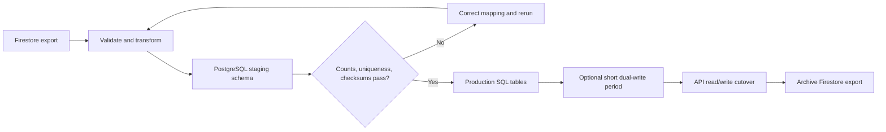

## 19. Immediate development roadmap

### Highest priority

1. Add automated Firebase rules tests.
2. Enable App Check and protect public submissions with rate limiting/CAPTCHA.
3. Align the landing media input types with Storage rules.
4. Add strict Firestore field validation and verified-email admin checks.
5. Configure Storage CORS and file malware scanning.

### Next

1. Extract a real router and lazy-load admin/judge/volunteer bundles.
2. Add CMS autosave with explicit dirty-state indication and version history.
3. Move destructive multi-document admin actions into Cloud Functions/API transactions.
4. Add pagination rather than fixed 100/250-record client reads.
5. Add data export/import and disaster-recovery runbooks.

### SQL readiness

1. Introduce a stable `eventId` into all current documents.
2. Stop using email as the long-term primary identity; link roles to UID/user ID.
3. Normalize team members in application logic before database migration.
4. Add immutable UUIDs for forms, fields, sections, and assets.
5. Record schema versions in CMS and settings documents.

## 20. Source-of-truth file index

When code and documentation disagree, inspect these files in this order:

| Concern | Source of truth |
|---|---|
| Route and public runtime | `src/App.tsx` |
| Shared participant models | `src/types.ts` |
| Landing content contract/defaults | `src/lib/landingContent.ts` |
| Editor behavior | `src/components/landing-editor/LandingEditorPage.tsx` |
| Draft/publish persistence | `src/components/AdminLandingEditorPage.tsx` |
| Public section rendering | `src/components/DynamicLandingSections.tsx` |
| Dynamic form contract | `src/lib/forms.ts` |
| Form management/submissions | `src/components/AdminFormsManager.tsx` |
| Registration/idea settings | `src/lib/formSettings.ts` |
| Firestore authorization | `firestore.rules` |
| Storage authorization | `storage.rules` |
| Privileged account deletion | `functions/index.js` |
| Deploy targets | `firebase.json` |

---

This documentation describes the repository state as inspected. Production document counts, billing, live indexes, enabled Auth providers, App Check state, Storage CORS, and deployed rule versions must be verified in the Firebase/Google Cloud consoles because they are runtime infrastructure state, not fully represented in source control.
